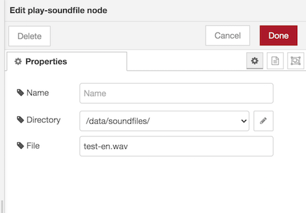

# node-red-contrib-play-soundfile

Plays a sound file on the system. Allows to set up a base directory which contains all the sound files. If no absolute directory path is supplied it will look for the file relative to the project directory.

## Installation

* Via Manage Palette -> Search for "node-red-contrib-play-soundfile"
* Via terminal: `cd ~/node-red; npm install node-red-contrib-play-soundfile`

## Usage

* see node help
